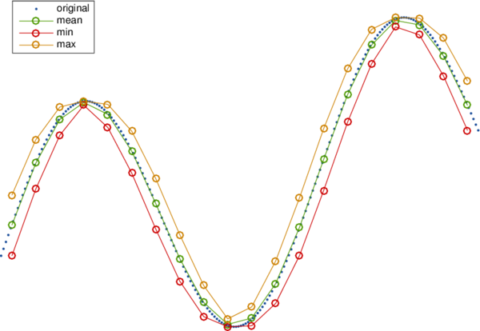

# Fast data decimation

## decim.m

This simple function resamples a vector or matrix for decimation using a fast, fully vectorized processing, and proposes different methods to compute the resulting samples from original data: mean value (default), median, sum (useful for cumulative data), min or max.

## Author
**François Beauducel**, [IPGP](www.ipgp.fr), [beaudu](https://github.com/beaudu), beauducel@ipgp.fr 

## Documentation
Type 'doc decim' for help and syntax.

