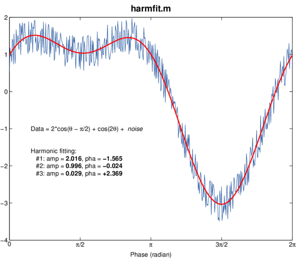

# Sinusoidal harmonic curve fitting

## harmfit.m

This is the core formula of discrete Fourier transform: it simply computes the amplitude and phase shift of fundamental or harmonics of a phase signal.

## Example
```matlab
t = linspace(0,2*pi);
x = 2*cos(t + pi/2) - cos(3*t) + rand(size(t));
harmfit(t,x,1:4)
```
returns estimations of amplitudes/phases for the first four harmonics.




## Author
**François Beauducel**, [IPGP](www.ipgp.fr), [beaudu](https://github.com/beaudu), beauducel@ipgp.fr 

## Documentation
Type 'doc harmfit' for help and syntax.
