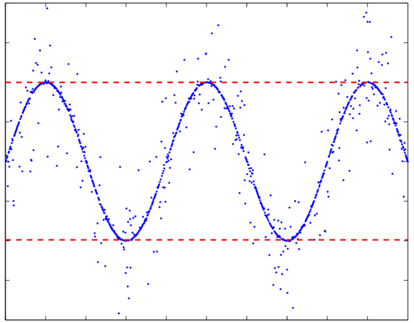

# Generalized median-style filter

## minmax.m

A little function that I imagined many years ago: a generalized "median-style" filter, an elegant way to generalize MIN, MAX, MEDIAN and extreme filtering functions, reduced to a single parameter. Let's sorting all values of a vector X in ascending order, thus consider the normalized rank position N of elements:
- N = 0 (first value) corresponds to the minimum of X;
- N = 1 (last value) is the maximum;
- N = 0.5 (middle position) is the median value;
- So what is N = 0.9 ? Answer is: it's the maximum of X after excluding the 10% amount of highest values.

A typical example of use is minmax(X,[0.01 0.99]) which returns minimum and maximum values of X(:) but excluding the 1% amount of extreme values. This is particularily efficient for automatic scaling of noisy data (see the screenshot example), compared to the use of MEAN and STD functions which is biased by any high-magnitude values in X.

Default behavior of MINMAX is to return a vector of minimum and maximum values. So minmax(X) is an abreviation of minmax(X,[0 1]), and equivalent of [min(X(:)) max(X(:))]. Compared to the built-in functions MIN and MAX, it does not return a vector from matrix but returns a scalar by considering all elements of matrix X. Also, it removes any NaN values (returns NaN only if all X values are NaN).

## Author
**François Beauducel**, [IPGP](www.ipgp.fr), [beaudu](https://github.com/beaudu), beauducel@ipgp.fr 

## Documentation
Type 'doc minmax' for help and syntax.

