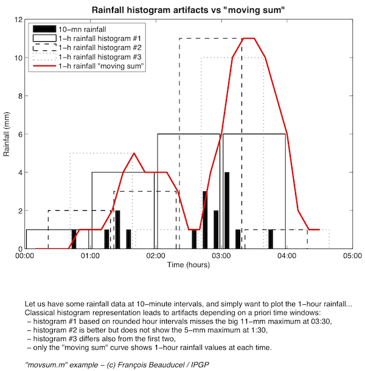

# Unbiased histogram method (moving sum)

## movsum.m

This function is a simple digital filter with one's coefficients, nearly equivalent to moving average but instead of mean values, it computes the sum. This is particularly usefull for rainfall plots for which it is, in my opinion, the only good way to show the data.

The figure attempts to demonstrate it. Let us have some rainfall data at 10-minute sampling interval, and simply want to plot the 1-hour rainfall... If you use classical histogram representation, it leads to artifacts that depends on a priori time windows offset you chose (see figure):
- histogram #1 based on rounded hour intervals, shows two 6-mm values between 02:00 and 04:00, and totally misses the 11-mm maximum at 03:30,
- histogram #2 is the same 1-hour histogram but shifted by 20 minutes; it seems better but does not show the 5-mm maximum at 1:30,
- histogram #3 is shifted by 40-minutes and differs again from the first two, 

As you can see, only the "moving sum" curve shows real 1-hour rainfall values at each time. 

## Author
**François Beauducel**, [IPGP](www.ipgp.fr), [beaudu](https://github.com/beaudu), beauducel@ipgp.fr 

## Documentation
Type 'doc movsum' for help and syntax.

## Important note
Since Matlab's release 2016a, a new function named "movsum" has been introduced by MathWorks, creating possible conflicts in function names.

