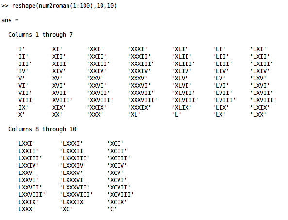

# Modern Roman numerals

These two scripts convert Roman numerals to and from any integer (scalar, vector or matrix), including large numbers greater than 4999 with the parenthesis notation (multiplies by 1000).

## num2roman.m
The function NUM2ROMAN uses strict rules of modern notation (substractive principle for 4 and 9 bases) except for the common 'MMMM' form replacing '(IV)'.

## roman2num.m
ROMAN2NUM is more flexible and is able to convert some other Roman notation possibilities, for instance the 3 different expressions roman2num({'IC','XCIX','XCVIIII'}) return [99,99,99], or roman2num({'MDXV','MCCCCCXV'}) return [1515,1515].

## Examples
```matlab
num2roman(1968)
num2roman(10.^(0:7))
reshape(num2roman(1:100),10,10)
```



## Author
**François Beauducel**, [IPGP](www.ipgp.fr), [beaudu](https://github.com/beaudu), beauducel@ipgp.fr 

## Documentation
Type 'doc num2roman' and 'doc roman2num' for help and syntax.
